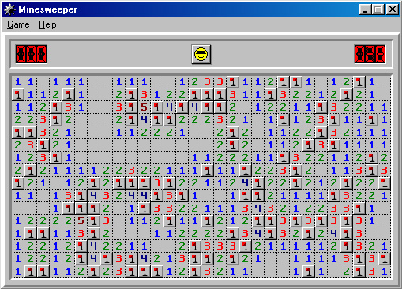



## MineSweeper AI

### Description

Resolve Minesweeper in less than 45 sec!

Just run the program, and start minesweeper in Expert level. Click around to produce a sufficiently large area for the program to work with.

beat this!

than click the START button, click on the minesweeper window and let the program handle the rest

It is rather cool to watch.

It uses a probabilitistic approach as well to try to resolve problems not normally resolvable.
 
### More Info
 
Minesweeper problem

Answer

             |
---                |---
**Submitted On**   |2001-06-07 10:13:02
**By**             |[Liu Yucheng](https://github.com/Planet-Source-Code/PSCIndex/blob/master/ByAuthor/liu-yucheng.md)
**Level**          |Intermediate
**User Rating**    |4.4 (22 globes from 5 users)
**Compatibility**  |VB 4\.0 \(16\-bit\), VB 4\.0 \(32\-bit\), VB 5\.0, VB 6\.0
**Category**       |[Complete Applications](https://github.com/Planet-Source-Code/PSCIndex/blob/master/ByCategory/complete-applications__1-27.md)
**World**          |[Visual Basic](https://github.com/Planet-Source-Code/PSCIndex/blob/master/ByWorld/visual-basic.md)
**Archive File**   |[MineSweepe20705662001\.zip](https://github.com/Planet-Source-Code/liu-yucheng-minesweeper-ai__1-23816/archive/master.zip)

